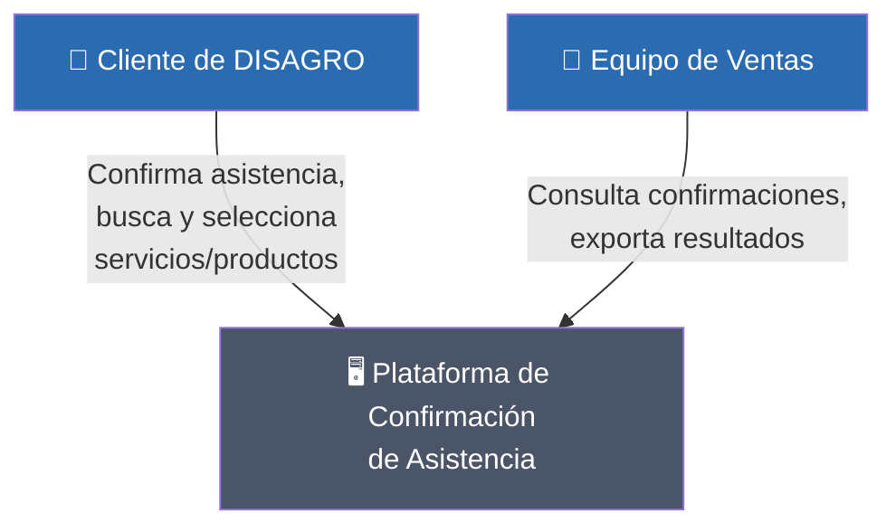
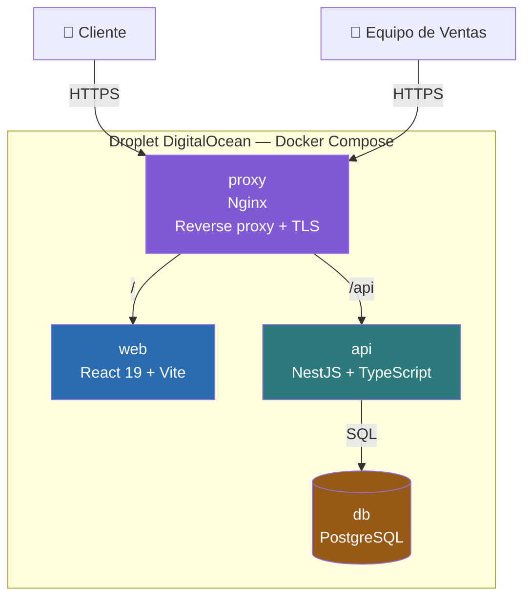
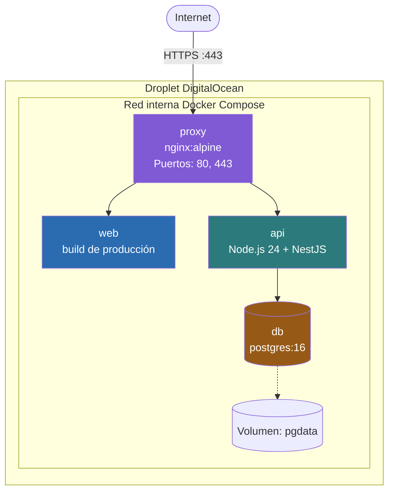
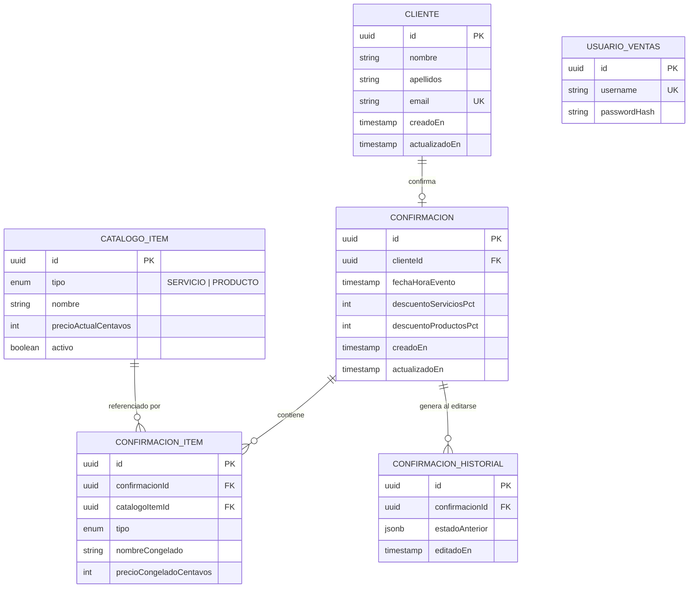
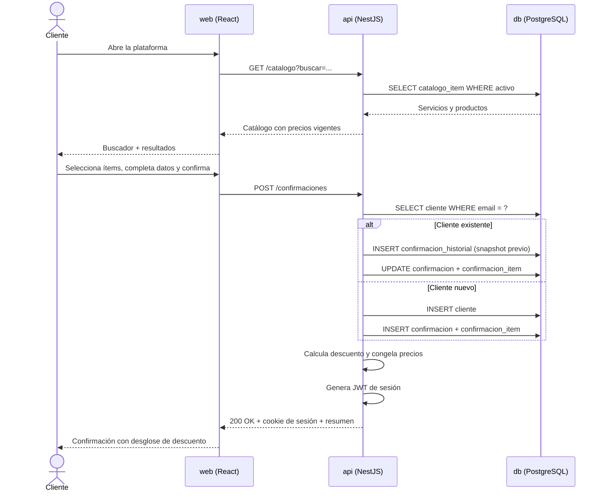
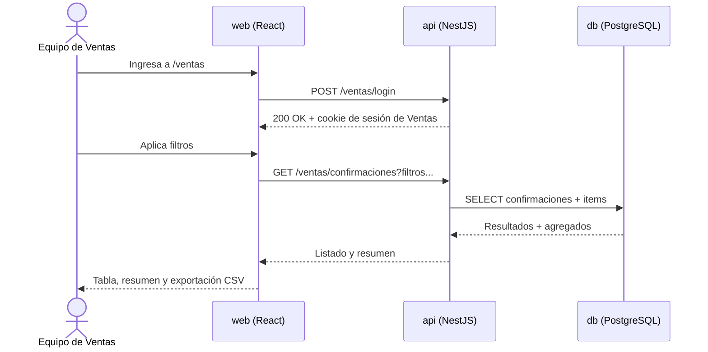

# Plataforma de Confirmación de Asistencia — Feria de Promociones DISAGRO

Plataforma para que los clientes de DISAGRO confirmen su asistencia a la Feria de Promociones anual, seleccionen los servicios y/o productos de su interés, y vean en el momento el descuento al que acceden según las reglas de la campaña. Con esa información, el equipo de Ventas puede preparar un portafolio de promociones personalizado por cliente.

## Índice

- [Arquitectura](#arquitectura)
- [Modelo de datos](#modelo-de-datos)
- [Flujos principales](#flujos-principales)
- [Reglas de descuento](#reglas-de-descuento)
- [Decisiones y supuestos](#decisiones-y-supuestos)
- [Stack tecnológico](#stack-tecnológico)
- [Estructura del repositorio](#estructura-del-repositorio)
- [Ejecución local](#ejecución-local)
- [Variables de entorno](#variables-de-entorno)
- [Pruebas](#pruebas)
- [Despliegue](#despliegue)
- [Plataforma en línea](#plataforma-en-línea)

---

## Arquitectura

### Contexto



### Contenedores



### Despliegue



Diagramas adicionales (secuencias completas) en [`/docs/diagramas`](./docs/diagramas).

---

## Modelo de datos



---

## Flujos principales

### Confirmación de asistencia



### Panel de Ventas



---

## Reglas de descuento

| Categoría | Condición | Descuento |
|---|---|---|
| Servicios | 2 o más servicios seleccionados | 3% |
| Servicios | 2 o más servicios y la suma de sus precios supera Q1,500 | 5% |
| Productos | 3 o más productos seleccionados | 3% |
| Productos | 5 o más productos seleccionados | 5% |

- Los descuentos de Servicios y Productos se calculan de forma independiente, cada uno sobre el subtotal de su propia categoría.
- Cuando una categoría cumple más de una condición simultáneamente, se aplica el porcentaje mayor.
- El cálculo es recalculado y validado siempre en el servidor; el valor mostrado en el cliente antes de confirmar es únicamente informativo.

---

## Decisiones y supuestos

El enunciado dejaba varios aspectos a mi criterio (reglas de descuento superpuestas, mecanismo de sesión, destino de despliegue, entre otros). Fui documentando cada decisión que tomé, con su justificación, como un Architecture Decision Record en [`/docs/adr`](./docs/adr):

| ADR | Decisión |
|---|---|
| [001](./docs/adr/001-superposicion-reglas-descuento.md) | Superposición de reglas de descuento: aplica el porcentaje mayor |
| [002](./docs/adr/002-descuentos-independientes-por-categoria.md) | Descuentos de Servicios y Productos calculados de forma independiente |
| [003](./docs/adr/003-mecanismo-de-sesion.md) | Sesión de cliente vía JWT en cookie httpOnly, emitida al confirmar |
| [004](./docs/adr/004-servicios-desplegables-independientes.md) | Frontend y backend como servicios desplegables independientes |
| [005](./docs/adr/005-seleccion-minima-obligatoria.md) | Selección de al menos un ítem obligatoria para confirmar |
| [006](./docs/adr/006-idempotencia-por-email.md) | Confirmación duplicada por email: actualiza el registro existente |
| [007](./docs/adr/007-congelamiento-de-precio.md) | Nombre y precio de cada ítem se congelan al momento de confirmar |
| [008](./docs/adr/008-destino-de-despliegue-digitalocean.md) | Despliegue en DigitalOcean (Droplet) |
| [009](./docs/adr/009-distribucion-del-enlace-de-acceso.md) | El enlace de acceso a la plataforma es único y público, no personalizado por cliente |
| [010](./docs/adr/010-rango-fecha-hora-evento.md) | Rango de fecha/hora del evento configurable por variables de entorno |
| [011](./docs/adr/011-rate-limiting-confirmaciones.md) | Rate limiting en el endpoint público de confirmación |
| [012](./docs/adr/012-endurecimiento-seguridad-complementario.md) | Helmet, rate limiting en login de Ventas y protección CSRF |

---

## Stack tecnológico

| Capa | Tecnología |
|---|---|
| Runtime | Node.js 24 LTS |
| Lenguaje | TypeScript (modo `strict`) |
| Backend | NestJS |
| ORM / Base de datos | Prisma + PostgreSQL |
| Frontend | React 19 + Vite |
| Estado de servidor | TanStack Query |
| Formularios | React Hook Form + Zod |
| Estilos | Tailwind CSS |
| Monorepo | pnpm workspaces |
| Pruebas | Vitest (+ Supertest en la API) |
| Contenedores | Docker (multi-stage) + Docker Compose |
| Proxy / TLS | Nginx + Let's Encrypt |
| Despliegue | DigitalOcean Droplet — `disagro.endtoendsolutions.dev` |

---

## Estructura del repositorio

```
.
├── apps/
│   ├── web/              # Frontend — React + Vite
│   └── api/              # Backend — NestJS
├── packages/
│   └── shared/           # Esquemas Zod, tipos y motor de descuentos compartidos
├── docs/
│   ├── diagramas/        # Diagramas de arquitectura, datos y flujos
│   └── adr/              # Registro de decisiones de arquitectura
├── docker-compose.yml
├── docker-compose.prod.yml
└── README.md
```

---

## Ejecución local

Requisitos: Docker y Docker Compose (y Node.js/pnpm si vas a usar el flujo de recarga en caliente).

Hay tres formas de correr el proyecto, según lo que necesites:

### Desarrollo con recarga en caliente (recomendado para trabajar en el código)

Solo la base de datos corre en Docker; `shared`, `api` y `web` corren en local con watch:

```bash
docker compose up -d db
cp .env.example apps/api/.env
cp .env.example apps/web/.env
pnpm install
pnpm dev
```

`shared` compila con `tsc -w`, `api` corre vía `dev.sh` (`tsc -w` + `node --watch`, no `tsx`, porque NestJS necesita `emitDecoratorMetadata` y `esbuild` no lo emite) y `web` corre con Vite (HMR). Un cambio en `apps/api/src/**` reinicia la API; un cambio en `apps/web/src/**` recarga el navegador; un cambio en `packages/shared/**` se recompila y llega a ambos.

- Frontend: `http://localhost:5173`
- API: `http://localhost:3000/api`
- Documentación de la API (OpenAPI/Swagger): `http://localhost:3000/api/docs`

### Stack completo en contenedores, sin TLS (para probar el build de punta a punta)

```bash
docker compose up --build
```

Levanta los cuatro contenedores (`proxy`, `web`, `api`, `db`) con las mismas imágenes multi-stage de producción. **No tiene hot reload** — cualquier cambio de código requiere reconstruir. Sirve para verificar que el proyecto arranca igual que en un servidor real, sin necesidad de TLS.

- Acceso: `http://localhost` (vía el proxy Nginx, puerto 80)

### Réplica exacta de producción (con TLS)

```bash
git clone <url-del-repositorio>
cd <nombre-del-repositorio>
cp .env.example .env
docker compose -f docker-compose.prod.yml up --build -d
```

Es el mismo `docker-compose.prod.yml` que corre en el Droplet.

El primer arranque de cualquiera de los tres flujos ejecuta las migraciones de Prisma y siembra el catálogo con datos de ejemplo.

---

## Variables de entorno

Ver `.env.example` para el detalle completo. Las principales:

| Variable | Descripción |
|---|---|
| `DATABASE_URL` | Cadena de conexión a PostgreSQL |
| `JWT_SECRET` | Secreto para firmar las sesiones de cliente y de Ventas |
| `VENTAS_USERNAME` / `VENTAS_PASSWORD` | Credenciales del panel de Ventas |
| `EVENTO_FECHA_INICIO` / `EVENTO_FECHA_FIN` | Rango de fechas válido para el campo "Fecha y Hora" de la confirmación (ver ADR-010); expuesto al frontend por la API para validar el selector |
| `VITE_API_URL` | URL base de la API consumida por el frontend |

---

## Pruebas

```bash
pnpm test
```

Incluye pruebas unitarias del motor de descuentos con los casos límite de las reglas (2 y 3 servicios, montos exactamente en Q1,500, 3 y 5 productos, selección vacía) y pruebas de integración de los endpoints principales de la API.

---

## Despliegue

La plataforma corre en un Droplet de DigitalOcean con `docker-compose.prod.yml`: cuatro contenedores (`proxy`, `web`, `api`, `db`) en una red interna de Docker. Solo `proxy` expone puertos al exterior (80 y 443); el resto solo es alcanzable dentro de la red interna. Usa el subdominio `disagro.endtoendsolutions.dev` (sobre el dominio propio `endtoendsolutions.dev`), con certificado TLS real vía Let's Encrypt.

---

## Plataforma en línea

`https://disagro.endtoendsolutions.dev`

## Acceso al Panel de Ventas

- URL: `https://disagro.endtoendsolutions.dev/ventas`
- Usuario: `ventas`
- Contraseña: `ds-ventas`

Son credenciales de un entorno de prueba, con datos sembrados — no corresponden a ningún dato real de producción.
