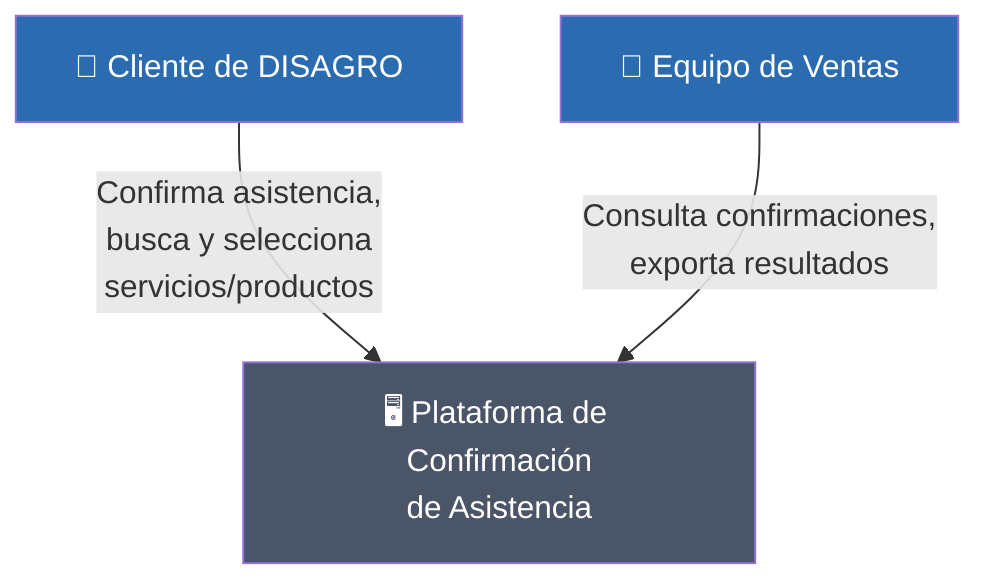
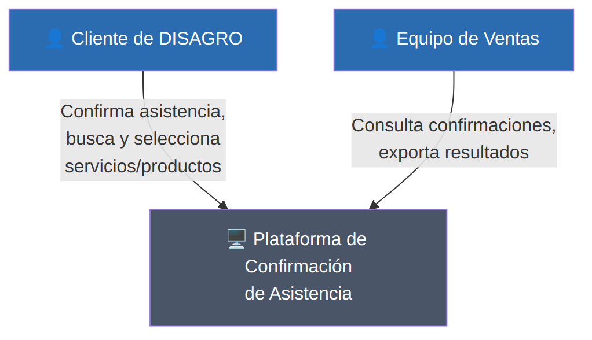

# Diagrama de Contexto

```mermaid
graph TB
    Cliente["👤 Cliente de DISAGRO"]
    Ventas["👤 Equipo de Ventas"]

    Plataforma["🖥️ Plataforma de Confirmación<br/>de Asistencia"]

    Cliente -->|"Confirma asistencia,<br/>busca y selecciona<br/>servicios/productos"| Plataforma
    Ventas -->|"Consulta confirmaciones,<br/>exporta resultados"| Plataforma

    style Plataforma fill:#4A5568,color:#fff
    style Cliente fill:#2B6CB0,color:#fff
    style Ventas fill:#2B6CB0,color:#fff
```

Ver como imagen (si el bloque anterior no se renderiza)

