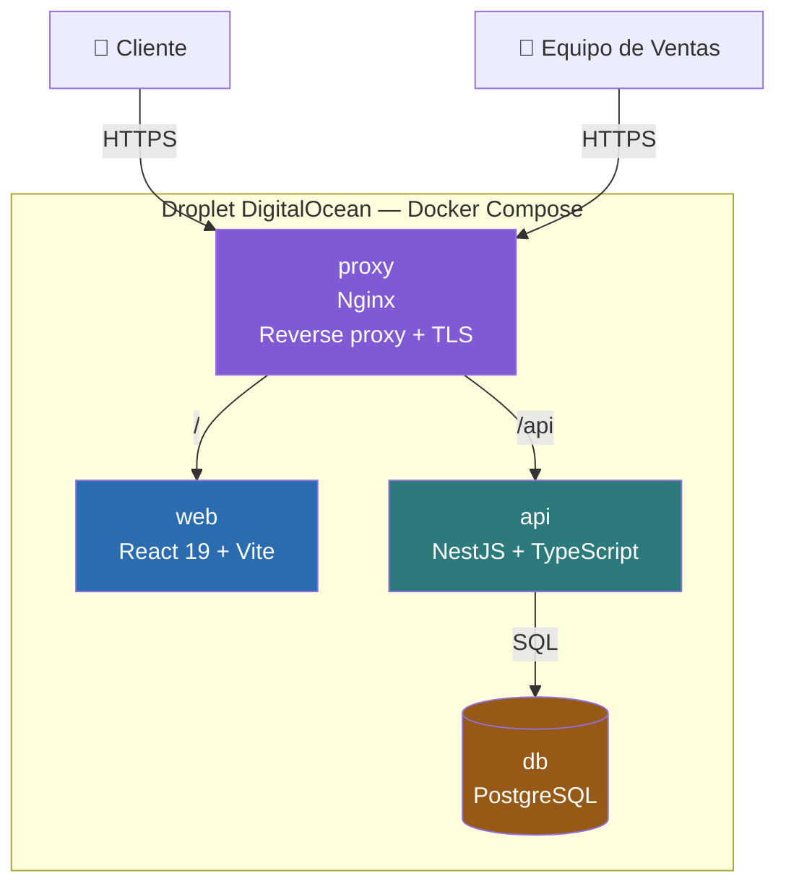

# Diagrama de Contenedores

```mermaid
graph TB
    Cliente["👤 Cliente"]
    Ventas["👤 Equipo de Ventas"]

    subgraph Droplet["Droplet DigitalOcean — Docker Compose"]
        Proxy["proxy<br/>Nginx<br/>Reverse proxy + TLS"]
        Web["web<br/>React 19 + Vite"]
        Api["api<br/>NestJS + TypeScript"]
        Db[("db<br/>PostgreSQL")]
    end

    Cliente -->|"HTTPS"| Proxy
    Ventas -->|"HTTPS"| Proxy
    Proxy -->|"/"| Web
    Proxy -->|"/api"| Api
    Api -->|"SQL"| Db

    style Proxy fill:#805AD5,color:#fff
    style Web fill:#2B6CB0,color:#fff
    style Api fill:#2C7A7B,color:#fff
    style Db fill:#975A16,color:#fff
```
