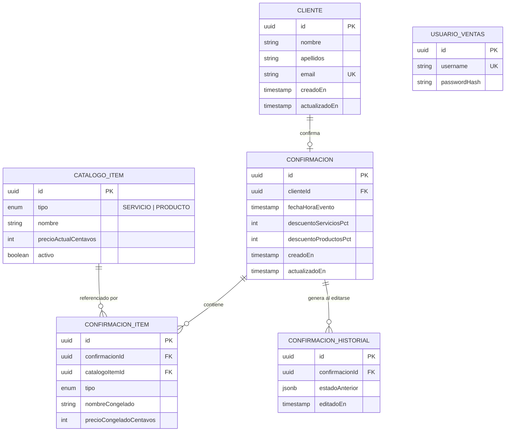

# Modelo de Datos (Entidad-Relación)

```mermaid
erDiagram
    CLIENTE ||--o| CONFIRMACION : "confirma"
    CONFIRMACION ||--o{ CONFIRMACION_ITEM : "contiene"
    CATALOGO_ITEM ||--o{ CONFIRMACION_ITEM : "referenciado por"
    CONFIRMACION ||--o{ CONFIRMACION_HISTORIAL : "genera al editarse"

    CLIENTE {
        uuid id PK
        string nombre
        string apellidos
        string email UK
        timestamp creadoEn
        timestamp actualizadoEn
    }

    CATALOGO_ITEM {
        uuid id PK
        enum tipo "SERVICIO | PRODUCTO"
        string nombre
        int precioActualCentavos
        boolean activo
    }

    CONFIRMACION {
        uuid id PK
        uuid clienteId FK
        timestamp fechaHoraEvento
        int descuentoServiciosPct
        int descuentoProductosPct
        timestamp creadoEn
        timestamp actualizadoEn
    }

    CONFIRMACION_ITEM {
        uuid id PK
        uuid confirmacionId FK
        uuid catalogoItemId FK
        enum tipo
        string nombreCongelado
        int precioCongeladoCentavos
    }

    CONFIRMACION_HISTORIAL {
        uuid id PK
        uuid confirmacionId FK
        jsonb estadoAnterior
        timestamp editadoEn
    }

    USUARIO_VENTAS {
        uuid id PK
        string username UK
        string passwordHash
    }
```
