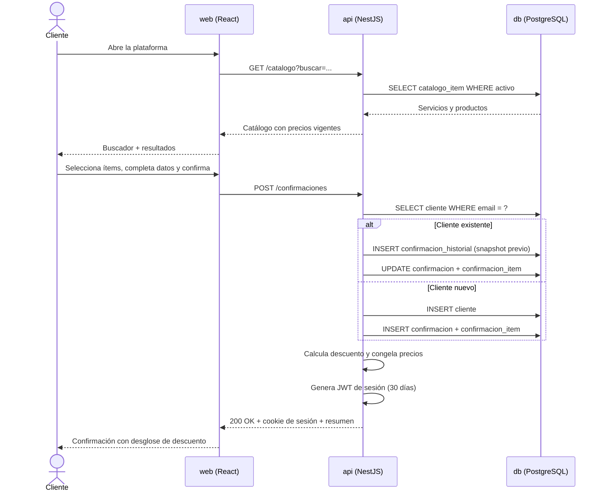

# Secuencia: Confirmación de asistencia

```mermaid
sequenceDiagram
    actor Cliente
    participant Web as web (React)
    participant Api as api (NestJS)
    participant DB as db (PostgreSQL)

    Cliente->>Web: Abre la plataforma
    Web->>Api: GET /catalogo?buscar=...
    Api->>DB: SELECT catalogo_item WHERE activo
    DB-->>Api: Servicios y productos
    Api-->>Web: Catálogo con precios vigentes
    Web-->>Cliente: Buscador + resultados

    Cliente->>Web: Selecciona ítems, completa datos y confirma
    Web->>Api: POST /confirmaciones

    Api->>DB: SELECT cliente WHERE email = ?
    alt Cliente existente
        Api->>DB: INSERT confirmacion_historial (snapshot previo)
        Api->>DB: UPDATE confirmacion + confirmacion_item
    else Cliente nuevo
        Api->>DB: INSERT cliente
        Api->>DB: INSERT confirmacion + confirmacion_item
    end

    Api->>Api: Calcula descuento y congela precios
    Api->>Api: Genera JWT de sesión (30 días)
    Api-->>Web: 200 OK + cookie de sesión + resumen
    Web-->>Cliente: Confirmación con desglose de descuento
```

Ver como imagen (si el bloque anterior no se renderiza)

