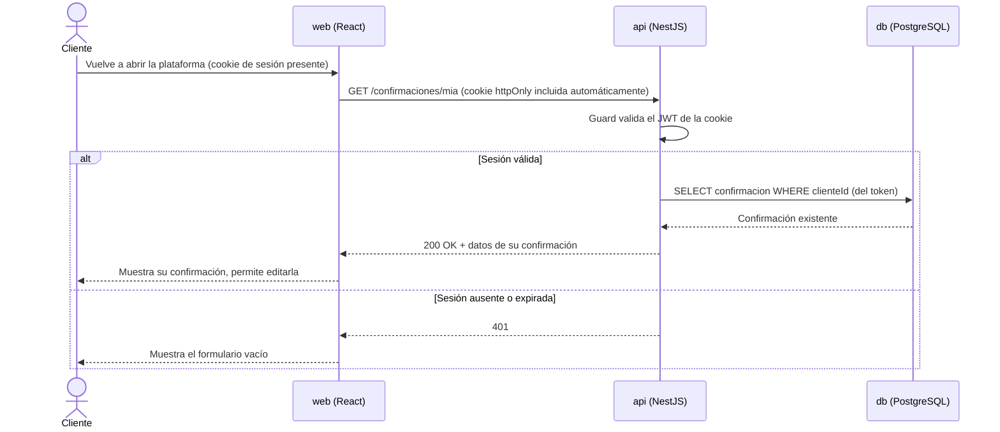

# Secuencia: Cliente regresa con sesión activa

```mermaid
sequenceDiagram
    actor Cliente
    participant Web as web (React)
    participant Api as api (NestJS)
    participant DB as db (PostgreSQL)

    Cliente->>Web: Vuelve a abrir la plataforma (cookie de sesión presente)
    Web->>Api: GET /confirmaciones/mia (cookie httpOnly incluida automáticamente)
    Api->>Api: Guard valida el JWT de la cookie
    alt Sesión válida
        Api->>DB: SELECT confirmacion WHERE clienteId (del token)
        DB-->>Api: Confirmación existente
        Api-->>Web: 200 OK + datos de su confirmación
        Web-->>Cliente: Muestra su confirmación, permite editarla
    else Sesión ausente o expirada
        Api-->>Web: 401
        Web-->>Cliente: Muestra el formulario vacío
    end
```
