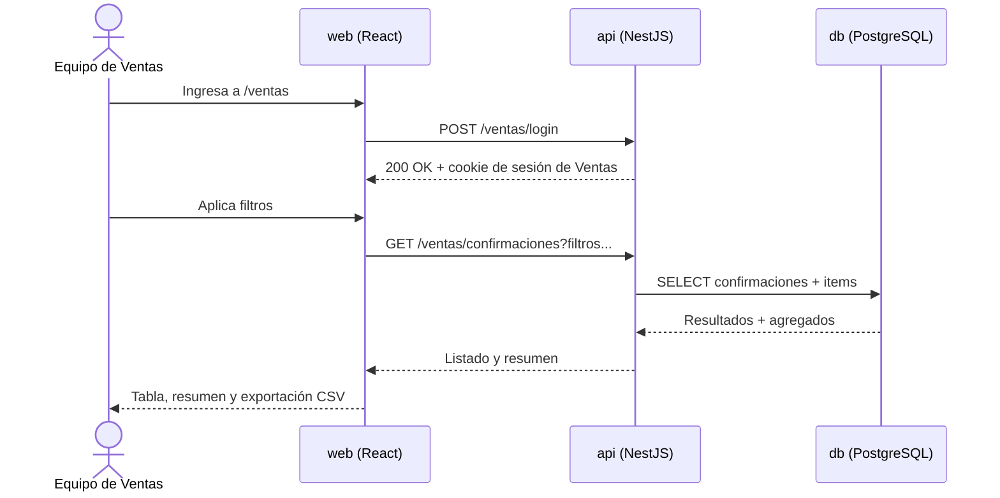

# Secuencia: Panel de Ventas

```mermaid
sequenceDiagram
    actor Ventas as Equipo de Ventas
    participant Web as web (React)
    participant Api as api (NestJS)
    participant DB as db (PostgreSQL)

    Ventas->>Web: Ingresa a /ventas
    Web->>Api: POST /ventas/login
    Api-->>Web: 200 OK + cookie de sesión de Ventas

    Ventas->>Web: Aplica filtros
    Web->>Api: GET /ventas/confirmaciones?filtros...
    Api->>DB: SELECT confirmaciones + items
    DB-->>Api: Resultados + agregados
    Api-->>Web: Listado y resumen
    Web-->>Ventas: Tabla, resumen y exportación CSV
```
