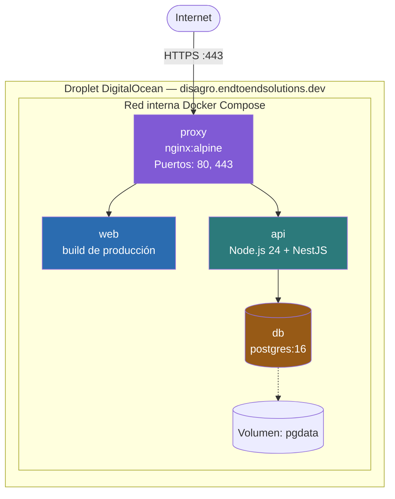

# Diagrama de Despliegue

```mermaid
graph TB
    Internet(["Internet"])

    subgraph VPS["Droplet DigitalOcean — disagro.endtoendsolutions.dev"]
        subgraph Network["Red interna Docker Compose"]
            NginxC["proxy<br/>nginx:alpine<br/>Puertos: 80, 443"]
            WebC["web<br/>build de producción"]
            ApiC["api<br/>Node.js 24 + NestJS"]
            DbC[("db<br/>postgres:16")]
            Vol[("Volumen: pgdata")]
        end
    end

    Internet -->|"HTTPS :443"| NginxC
    NginxC --> WebC
    NginxC --> ApiC
    ApiC --> DbC
    DbC -.-> Vol

    style NginxC fill:#805AD5,color:#fff
    style WebC fill:#2B6CB0,color:#fff
    style ApiC fill:#2C7A7B,color:#fff
    style DbC fill:#975A16,color:#fff
```
